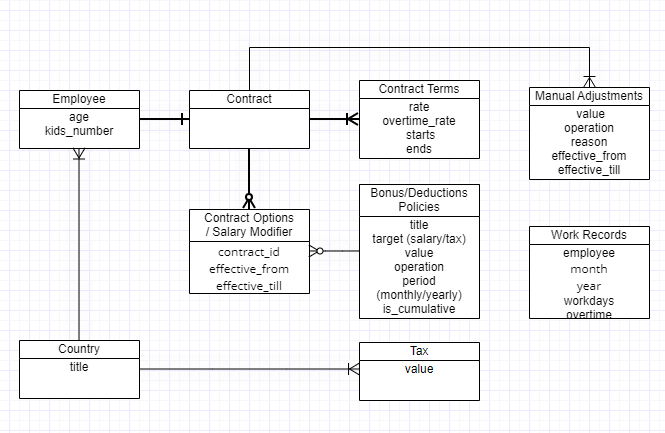

# RealForce.ch Test
In this demo only core domain logic for salary calculation is implemented and simple console command to test calculations. Data storage and some implementation details are abstracted by interfaces, some basic mock classes and data provided for demonstration reasons.

## Directories structure

```
src
   Model/Payroll    - core domain logic for salary calculations
   Demo             - some basic mock classes to test the implementation, not for evaluation
   Demo/Command     - simple console command to demonstarte the concept
tests               - A few tests
dataset             - Simple test datatset in JSON files
```

## Installation

PHP 7.4 is required.  
Clone the repo.  
`composer install`

## Demo:
`bin/console app:salary-report`  
`vendor/bin/simple-php-unit`

## Architecture
App domain model has the following entities:
- Employee
- ContractTerms
- SalaryModificator & Tax Modificator
- EmployeeSalaryModificator && EmployeeTaxModificator

`Employee` entity represents basic profile with name, kids number, age e.t.c.

`ContractTerms`  entity describes base rate, overtime rate, effective time and other contract details.

`SalaryModificator` and `TaxModificator` - describe company's policies regarding bonuses/deduction for salary and taxes. They include title, operation type and bonus/deduction amount.

Each policy is applied to each employee individually as an `EmployeeSalaryModificator` or `EmployeeTaxModificator`. These entities represent `Salary/TaxModificator` assignment to `Employee` with additional data, which includes effective time period for each modificator.



Salary calculation and bonus/deductions management are split to two independent processes.
 
Salary calculator (`App/Model/Services/EarningsCalculator`)  
 doesn't check if any of salary/tax modificators valid for current user or not. It just gets active modificators for current user and applies each of them to base salary rate.
 
Salary/Tax modificators are designed to be applied either manually or by some automatic rules, system lifecycle hooks or periodic tasks.
 
For example:
   - `Uses company car` salary modificator would be added manually whenever user decides to use or stop using a company car.
   - `Bonus for elder employees` policy could be added either by some cron-based daily birthday checker or on employee user creation (or birthday update in employee profile). Each modificator assignment has effective_from and effective_till attributes, so the second option would be preferable.
   - `More than two kids` modificator could be added by profile update lifecycle event handler: whenever kids count is updated.
   
**Note: I have implemented neither of these hooks in this demo task as this makes it too huge. I could implement some part of it on request. Instead, I provide a test dataset with already applied modificators** 

As this is only a demo task for simplicity Salary and Tax modificators are considered to be additive deltas based on base salary and tax, independent of each other, unordered.


